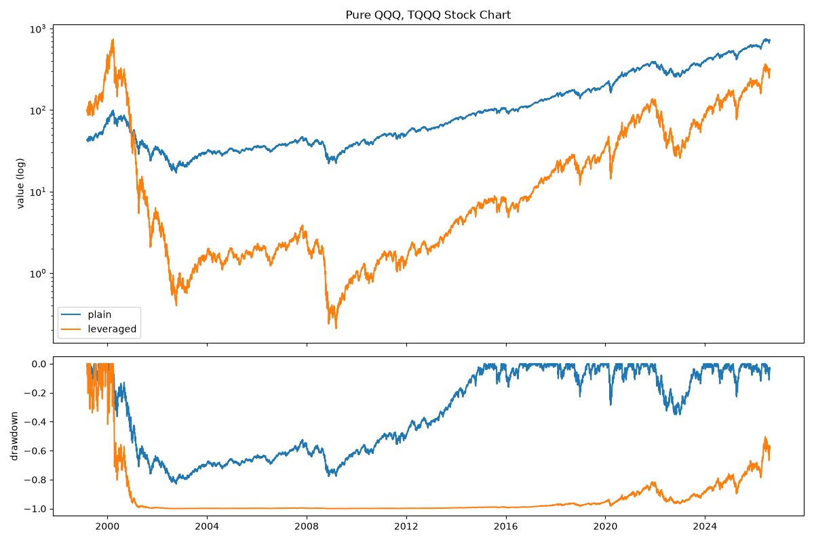
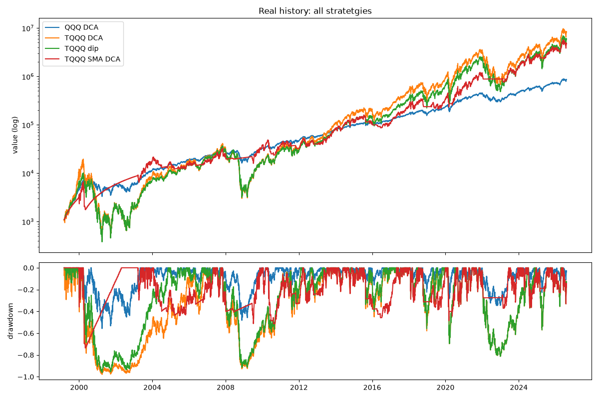
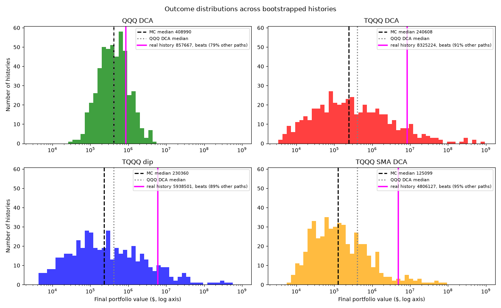
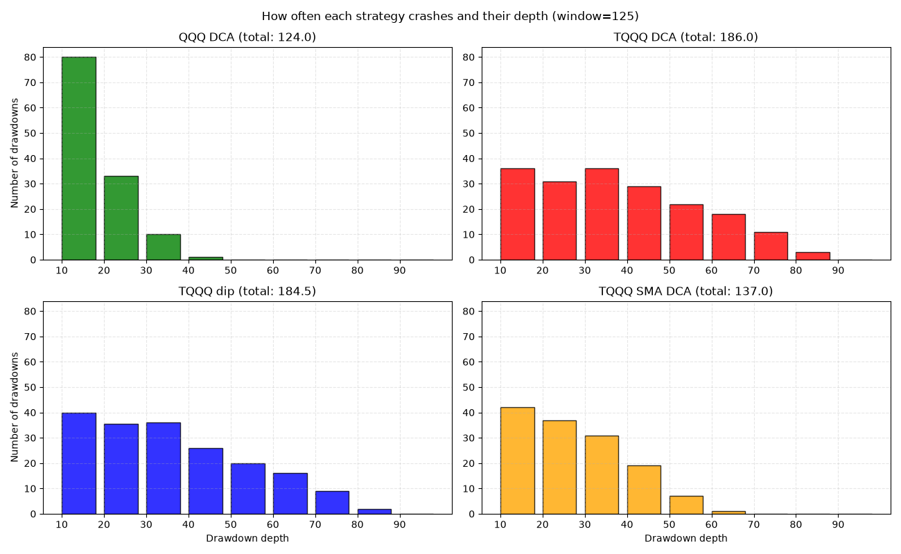
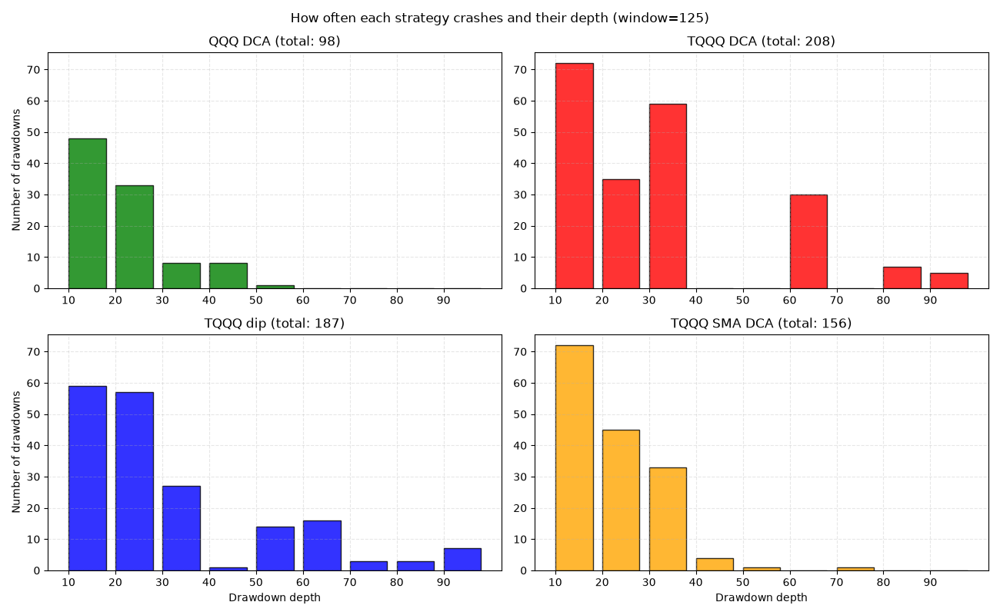

# Leveraged ETF Research Platform

Backtesting framework analyzing leveraged ETFs like QLD and TQQQ from QQQ or SSO and UPRO from SPY across 27 years of market history - including the dot-com crash that real leveraged funds never lived through.

The core idea: leveraged ETF's like TQQQ(2010) only exist after the post crash of the dot-com bubble and the subprime-mortage crisis. This project reconstructs their full history from the underlying index and validates the reconstruction against the real funds (~0.999 daily-return correlation), so different strategies can be tested.

>[!IMPORTANT]
>In this research I used QQQ and TQQQ as case studies. The Table and Graphs are based on the 8.Aug.2026 of QQQ 

## The problem this project solves

Is leveraged strategy actually better than just buying the index.


## Findings

### Basic Comparison Plain Asset vs Leveraged Asset
- TQQQ Lost to QQQ over 1999-2026. Synthetic TQQQ compounded at ~4.3%/year vs QQQ's ~10.9% with a -99.97% max drawdown during the dot-com bubble and spent ~26years underwater till today and still below -50-60% to the all time high during the dot-com bubble. - invisible in every TQQQ backtest that starts in 2010.

- If we compare from the date the TQQQ was launched: "2010-02-11", TQQQ is performing 19 times better than the QQQ althought the TQQQ had multiple crashes to 60-80% since its launch. 





### Now to the Leverage Strategies
>[!IMPORTANT]
> TQQQ dip is a DCA that only activates during a dip which is defined as: DIP = dict(max_at=50, min_at=20, window=125)
>SMA DCA sells the position under the SMA and buys when the asset is over the SMA. Set as SMA_RATE = 200

1. On our real history, leverage looks perfect
DCA of $100 every 10 trading days, with a $1,000 starting capital, 1999-2026 (total investment: $70K):

| Strategy | Final Value | Total Invested | Max Drawdown | Longest Underwater | Multiple on Investment | vs QQQ DCA |
|----------|------------:|---------------:|-------------:|-------------------:|-----------------------:| ---------------:|
| QQQ DCA  | $857,667 | $70,000 | -0.558 | 2.639 | 12.252 | ---|
| TQQQ DCA | $8,325,224 | $70,000 | -0.978 | 6.567 | 118.932 | 9.71 |
| TQQQ dip | $5,938,501 | $70,000 | -0.963 | 4.615 | 84.836 | 6.92 |
| TQQQ SMA DCA | $4,806,127 | $70,000 | -0.736 | 3.286 | 68.659 | 5.60 |



2. Across 500 Monte Carlo alternative histories, leverage loses. 
Block-boostrap resampling (20-day blocks of real QQQ returns, leverage applied to each paths) produced 500 alternative histories.

| Strategy | Median Final | Mean Final | 5th pct | 95th pct | Median max DD | winrate vs QQQ DCA
|----------|------------:|-----------:|-----------:|------------:|-------------------:| -------------------------:|
| QQQ DCA  | $408,990 | $620,436 | $92,910 | $1,729,396 | -51.7% | ---|
| TQQQ DCA | $240,608 | $9,106,648 | $9,381 | $20,522,588 | -95.9% | 38.6% |
| TQQQ dip | $230,360 | $8,507,093 | $10,589 | $19,820,947 | -95.4% | 36.8% |
| TQQQ SMA DCA | $125,099 | $1,345,826 | $14,962 | $3,771,008 | -85.8% | 19.8% |



- Strategy win rate vs TQQQ DCA:
  TQQQ dip beats TQQQ DCA in 52.0% of paths
  TQQQ SMA DCA beats TQQQ DCA in 36.8% of paths

3. Our history is lucky

- We have a handful of extraordinary universes carry the average while the typical is underperforming. (The TQQQ mean (9Million) against its median 240K.)

- Every strategy did better in reality than in a typical simulated history.
The secret is the timing the dot-com bubble crash happend when a investor starting 1999 DCA almost invested nothing. And the crashes the past decade happended after the money already compounded a lot.


4. Defensive stops or sell offs saves the crashes but cuts the upside.

- We can observe that the TQQQ Dip and DCA have more brutal crashes than the other two:

Drawdowns across the 500 Monte Carlo Path in Median

Drawdowns in our real history

 

- SMA-200 rotation elminates the catastrophic crashes entirely but it drops the win rate against QQQ and beats TQQQ DCA only in 36.8% of histories.

- Dip-buying shows the same pattern more weakly: it beats plain TQQQ in 52% of histories, but it wins 

## Remaining Research

The research is ongoing. The following areas remain to be investigated:

- A Universe without the Dot-com bubble
- new strategies: DCA with switching assets etc.. 

## Architecture

```text data  -> strategy -> executor -> measure -> visualize```

- data: download, divided-adjust, simulate the leveraged series, splice the synthetic history onto real (if needed)
- strategy: stock - cash allocation (```1.0```= fully invested, ```0.0``` = holding full cash, ```Nan``` = don't trade)
- executor: ```python dca() ``` runs any strategy, investing period and amount, start capital and time, optionally allowed to sell
- measure: ```python describe_portfolio()```
- visualize: stock charts, drawdown histogram, outcome distributions 


## How to Run
```python
python3 -m venv .venv
source .venv/bin/active
pip install -r requirements.txt

python main.py

# Each single executions
# python -m scripts.real_history
# python -m scripts.monte_carlo
# python -m scripts.drawdown_counts

```


## Caveats

- all simulated histories are reshuffles of one real 1999 - 2026 period. Those are plausible paths but do not predict the future

- no transactions costs, taxes or bid- ask spread are taken in account

- Drawdowns are used in a 125days window. Years of decline can be counted as multiple drawdowns rather than a single drawdown. V-shape rebounds can be not listed: if the window starts in 2025 April it misses the ~25% drawdown that rebounded and hit its all time high around in 125 days which results in 0% drawdown.

# Tech Stack
python, yfinance, pandas, numpy, matplotlib, pytest